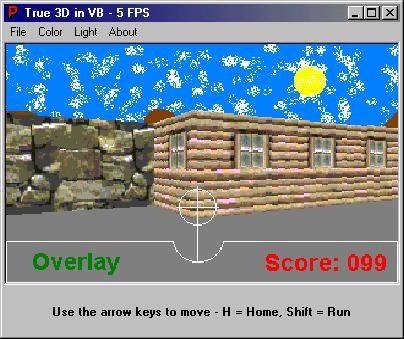



## TRUE 3D in VB

### Description

This is a very nice Direct X 7 engine. It lets you walk around and edit 3D worlds. I'm tired so I'm not gonna post a whole huge description of it. Just download it and see.
 
### More Info
 

             |
---                |---
**Submitted On**   |2000-06-10 03:50:48
**By**             |[Viper Tec\.](https://github.com/Planet-Source-Code/PSCIndex/blob/master/ByAuthor/viper-tec.md)
**Level**          |Intermediate
**User Rating**    |4.6 (41 globes from 9 users)
**Compatibility**  |VB 5\.0, VB 6\.0
**Category**       |[Complete Applications](https://github.com/Planet-Source-Code/PSCIndex/blob/master/ByCategory/complete-applications__1-27.md)
**World**          |[Visual Basic](https://github.com/Planet-Source-Code/PSCIndex/blob/master/ByWorld/visual-basic.md)
**Archive File**   |[CODE\_UPLOAD66066102000\.zip](https://github.com/Planet-Source-Code/viper-tec-true-3d-in-vb__1-8792/archive/master.zip)

